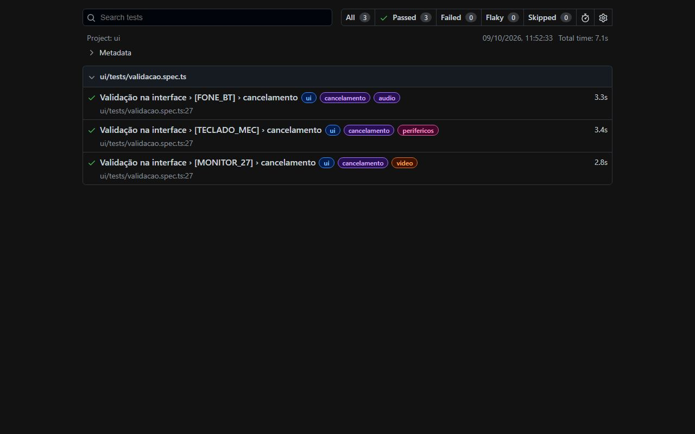

  
  
  
  

### Sobre mim

Senior QA Engineer com mais de 10 anos entre QA, testes e integrações. Automatizo testes **Web, Mobile
e API** integrados ao banco de dados, de ponta a ponta: crio a massa pela API, acompanho o processamento
no sistema, valido cada campo na interface e no banco e entrego o resultado pronto, para o time testar
mais e documentar menos.

| 2.096 | −94% | −96% | 240+ |
| :---: | :---: | :---: | :---: |
| cenários automatizados de ponta a ponta | de esforço humano por ciclo de regressão | de material de teste a manter | campos conferidos por execução |

### Projetos em destaque

<table>
  <tr>
    <td width="50%" valign="top">
      
       <b><a href="https://marcossilva-qa.github.io/case/esteira-qa.html">Esteira de automação de QA ↗</a></b>
       CASE · TELECOM E STREAMING
       Cria assinaturas pela API, acompanha a orquestração no Salesforce, valida mais de 240 campos e entrega a evidência pronta. Cerca de 1.012 h liberadas por ciclo de regressão.
    </td>
    <td width="50%" valign="top">
      
       <b><a href="https://github.com/marcossilva-qa/qa-e2e-pipeline">qa-e2e-pipeline ↗</a></b>
       CÓDIGO ABERTO · CI VERDE
       A mesma arquitetura contra uma loja pública: massa data-driven com Newman, espera com critério de pronto, validação com Playwright e <a href="https://marcossilva-qa.github.io/qa-e2e-pipeline/">relatórios ao vivo</a>.
    </td>
  </tr>
</table>

### Stack e ferramentas

  &nbsp;
  &nbsp;
  &nbsp;
  &nbsp;
  &nbsp;
  &nbsp;
  &nbsp;
  &nbsp;
  &nbsp;
  &nbsp;
  &nbsp;
  &nbsp;
  &nbsp;
  &nbsp;
  &nbsp;
  &nbsp;
  &nbsp;
  &nbsp;
  &nbsp;
  &nbsp;
  

Também: Gherkin e Cucumber.js (BDD) · Robot Framework · OpenText Octane · Page Object Model · testes orientados a dados · validação de contrato

### Formação e certificação

- **ISTQB CTAL-TA** · Certified Tester Advanced Level, Test Analyst
- **Tecnólogo em Análise e Desenvolvimento de Sistemas** · Universidade Pitágoras Unopar Anhanguera
- **Inglês** avançado (C1)
